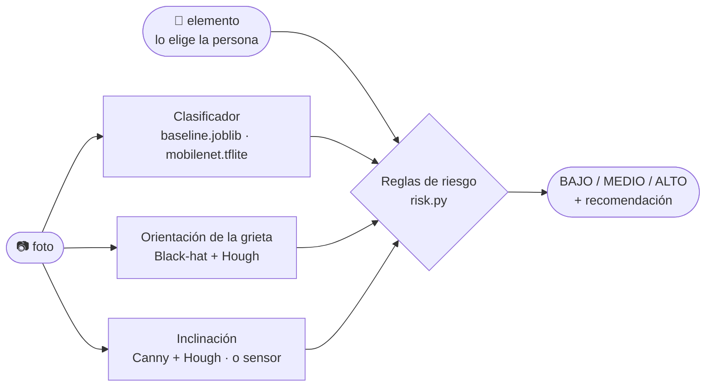

<div align="center">

# 🏗️ Detección de grietas, inclinación y riesgo en edificaciones

**Foto → ¿hay grieta? → ¿qué orientación? → ¿está a plomo? → riesgo BAJO / MEDIO / ALTO**

[](https://www.python.org/)
[](https://www.tensorflow.org/)
[](https://opencv.org/)
[](https://streamlit.io/)
[](android/README_ANDROID.md)
[](tests/test_pipeline.py)

Reto de la mejor implementación · **Algoritmos y Programación 2026-2** · Ingeniería en Inteligencia Artificial · Universidad Industrial de Santander

</div>

> ⚠️ **Herramienta orientativa con fines académicos. No sustituye la inspección de un ingeniero civil.** Un nivel "BAJO" no certifica que una edificación sea segura; un nivel "ALTO" significa que vale la pena que la revise un profesional.

---

## 📌 Qué hace

A partir de una fotografía de un elemento de una edificación (columna, viga, muro, placa) el sistema responde tres preguntas y las combina en una recomendación:

| Módulo | Técnica | Salida |
|---|---|---|
| **¿Hay grieta?** | Línea base (descriptores + regresión logística) o **MobileNetV2** con transfer learning | `con grieta` / `sin grieta` + probabilidad |
| **¿Qué orientación tiene?** | Transformada Black-hat + Hough (OpenCV) | `vertical` / `horizontal` / `diagonal` |
| **¿El elemento está a plomo?** | Canny + Hough + mediana ponderada, o inclinómetro del celular | ángulo de desaplome (°) + categoría |
| **¿Qué riesgo hay?** | Reglas de ingeniería (sistema de puntos transparente) | `BAJO` / `MEDIO` / `ALTO` + recomendación + razones |



Se puede usar de cuatro formas: **consola** (`predict.py` → JSON), **app web** (Streamlit, subir foto o cámara), **desde el celular** por Wi-Fi y **app Android nativa** con el modelo `.tflite` corriendo en el teléfono.

---

## 🚀 Inicio rápido

### 1. Instalar (una sola vez)

```bash
git clone https://github.com/<usuario>/grietas-riesgo.git
cd grietas-riesgo
python -m venv .venv
.venv\Scripts\activate          # Windows   |   source .venv/bin/activate  (Linux/macOS)
pip install -r requirements.txt
pip install ai-edge-litert      # intérprete para mobilenet.tflite (alternativa: pip install tensorflow)
```

### 2. Probar sin dataset (5 minutos)

```bash
python src/make_synthetic_data.py                                  # 400 parches sintéticos
python src/baseline.py --root data/synthetic --out models/baseline.joblib
python src/predict.py docs/demo/columna_grieta_diagonal_+2.5deg.jpg --elemento columna
python tests/test_pipeline.py                                      # 5 × OK
streamlit run src/app_streamlit.py                                 # http://localhost:8501
```

### 3. Flujo completo con el dataset real (un solo comando)

1. Descarga [Surface Crack Detection](https://www.kaggle.com/datasets/arunrk7/surface-crack-detection) de Kaggle (`archive.zip`, ~230 MB).
2. Copia el zip dentro de `data/` (sin descomprimir).
3. Ejecuta:

```bash
python ejecutar_todo.py
```

Descomprime el dataset, hace el EDA, entrena la línea base con 4 000 fotos por clase, predice, corre las pruebas, detecta `models/mobilenet.tflite` si existe y abre la app web con el mejor modelo disponible. Opciones: `--max-por-clase 1000` (rápido), `--sin-app`, `--zip <ruta>`.

En **VS Code**: la carpeta `.vscode/` trae 12 configuraciones listas (`Ctrl+Shift+D` → elegir → `F5`); la **0. EJECUTAR TODO** hace lo mismo que el comando anterior.

### 4. Entrenar MobileNetV2 (Google Colab, GPU T4, ~10 min)

Sube a Drive `archive.zip` y un zip de `src/`, abre [`entrenar_mobilenet_colab.ipynb`](entrenar_mobilenet_colab.ipynb) en Colab y ejecuta las 11 celdas. Genera `mobilenet.tflite` (4,5 MB), `mobilenet_metricas.json` y `curvas.png`; cópialos a `models/` y vuelve a correr `ejecutar_todo.py`.

---

## 📱 En el celular

| Opción | Cómo | Cámara | Sin PC |
|---|---|---|---|
| Misma Wi-Fi | `python app_celular.py` → abrir en el teléfono la URL que imprime | vía "Subir archivo → tomar foto" | ✗ |
| Túnel HTTPS | `cloudflared tunnel --url http://localhost:8501` | ✓ | ✗ |
| Streamlit Community Cloud | desplegar `src/app_streamlit.py` desde este repo | ✓ | ✓ |
| **App Android nativa** | [`android/`](android/README_ANDROID.md): Kotlin + `.tflite` + acelerómetro | ✓ | ✓ (sin internet) |

Guía completa: [`docs/EJECUCION_CELULAR.md`](docs/EJECUCION_CELULAR.md).

---

## 📊 Resultados

Dataset: **Concrete Crack Images for Classification** (Özgenel, METU 2018; réplica en Kaggle), 40 000 parches 227×227 de concreto, 50 % con grieta. Se usa una submuestra de 4 000 por clase (semilla 42) dividida 70/15/15 de forma estratificada; **ambos modelos se evalúan sobre las mismas 1 200 fotos de prueba**.

| | Línea base | MobileNetV2 (.tflite) |
|---|---|---|
| Descripción | 16 descriptores (Black-hat, Canny, histograma) + regresión logística | ImageNet preentrenado, cabeza nueva, fine-tuning de 30 capas, float16 |
| Exactitud | _[pendiente]_ | **0.9967** |
| Precisión | _[pendiente]_ | 0.9983 |
| Recall | _[pendiente]_ | 0.9950 |
| F1 | _[pendiente]_ | 0.9967 |
| Matriz de confusión `[[VN,FP],[FN,VP]]` | _[pendiente]_ | `[[599, 1], [3, 597]]` |
| Parámetros | 17 | ~2,3 M |
| Tamaño en disco | 1,9 kB | 4,46 MB |
| Inferencia (CPU de PC) | ~20 ms | ~25–33 ms |
| Interpretable | ✓ | ✗ |

<p align="center"></p>

**Hallazgo destacado (cambio de dominio):** la imagen sintética de demostración es clasificada *con grieta* por la línea base (p = 1,00) y *sin grieta* por MobileNet (p = 0,23). El modelo potente aprendió la textura del concreto real y no reconoce un trazo dibujado; el simple reacciona a cualquier línea oscura. Por eso la validación final se hace con fotos reales propias.

---

## 🗂️ Estructura del repositorio

```
grietas-riesgo/
├── ejecutar_todo.py / .bat        flujo completo con el dataset real
├── app_celular.py / .bat          app web accesible desde el celular (misma Wi-Fi)
├── entrenar_mobilenet_colab.ipynb cuaderno de entrenamiento para Colab
├── requirements.txt               dependencias (compatibles con Streamlit Cloud)
├── .vscode/                       12 configuraciones de ejecución para VS Code
├── src/
│   ├── make_synthetic_data.py     parches sintéticos para probar el flujo
│   ├── dataset.py                 carga, EDA, división 70/15/15
│   ├── features.py                descriptores de la línea base
│   ├── baseline.py                entrenamiento + métricas + complejidad
│   ├── train_transfer.py          MobileNetV2, aumentación, fine-tuning, exportación TFLite
│   ├── inclination.py             ángulo de desaplome (Hough o sensor)
│   ├── risk.py                    orientación de la grieta + reglas de riesgo
│   ├── predict.py                 CLI: foto → JSON (.joblib / .tflite / .keras)
│   └── app_streamlit.py           app web
├── android/                       app Android nativa (Kotlin) — ver android/README_ANDROID.md
├── tests/                         test_pipeline.py (5 pruebas) + generador de imágenes demo
├── models/                        baseline.joblib, mobilenet.tflite y sus *_metricas.json
├── data/                          raw/ (no se versiona), synthetic/, propias/
└── docs/                          documentación (ver abajo), plan de sprints, demos
```

---

## 📚 Documentación

| Documento | Contenido |
|---|---|
| [`docs/DOCUMENTACION.md`](docs/DOCUMENTACION.md) | Todo lo hecho: entorno, bitácora de problemas y correcciones, ejecución, dataset, modelos, comparación, limitaciones, pendientes |
| [`docs/documentacion_codigo.pdf`](docs/documentacion_codigo.pdf) | **Explicación línea a línea del código**, cada operación matemática y el porqué de cada decisión (34 páginas, fuente `.tex` incluida) |
| [`docs/EJECUCION_CELULAR.md`](docs/EJECUCION_CELULAR.md) | Las cuatro formas de usar el sistema en el celular |
| [`android/README_ANDROID.md`](android/README_ANDROID.md) | Compilar e instalar la app Android |
| [`docs/SPRINTS.md`](docs/SPRINTS.md) | Plan Scrum: 6 sprints alineados con los tres cortes (25/09, 23/10, 20/11) |
| [`docs/entrega1_formulacion.md`](docs/entrega1_formulacion.md) | Documento de formulación de la Entrega 1 |
| [`data/README.md`](data/README.md) | Cómo obtener el dataset y cómo nombrar las fotos propias |

---

## 🧪 Ejemplo de salida (`predict.py`)

```json
{
  "grieta": {"clase": "con grieta", "probabilidad": 1.0, "orientacion": "diagonal",
             "ms_inferencia": 24.65, "modelo": "tflite"},
  "inclinacion": {"angulo_desaplome": 2.48, "signo": "derecha", "categoria": "inclinado",
                  "n_lineas": 4, "referencia": "vertical", "metodo": "hough"},
  "riesgo": {"nivel": "ALTO", "puntaje": 11,
             "recomendacion": "Restringir el uso del área y solicitar inspección URGENTE de un ingeniero civil...",
             "detalle": {"razones": ["grieta detectada con alta confianza",
                                     "orientación diagonal en columna",
                                     "grieta diagonal en elemento portante: posible falla por cortante",
                                     "desaplome apreciable (2.5°)"]}}
}
```

---

## ⚖️ Reglas de riesgo (resumen)

| Factor | Puntos |
|---|---|
| Orientación de la grieta | vertical 1 · horizontal 2 · diagonal 3 · desconocida 2 |
| Elemento | muro no estructural 0 · muro de carga 2 · placa 2 · columna 3 · viga 3 |
| Probabilidad ≥ 0,9 | +1 |
| Diagonal en columna / viga / muro de carga (posible cortante) | +2 |
| Horizontal en columna (posible flexión) | +2 |
| Desaplome ≥ 3° / ≥ 1° | +4 / +2 |
| Inclinación no medible en la foto | 0 (se informa) |
| **Nivel** | **ALTO ≥ 7 · MEDIO ≥ 3 · BAJO < 3** |

Son reglas orientativas basadas en la práctica de inspección visual y la NSR-10; están pendientes de revisión con criterio de ingeniería civil.

---

## ⚠️ Limitaciones conocidas

- El dataset es de **concreto liso en primer plano**: ladrillo, pañete, pavimento o fachadas completas están fuera de lo aprendido.
- La inclinación por imagen necesita una **arista vertical visible** y el celular nivelado; una foto torcida se interpreta como elemento torcido (mitigación: inclinómetro del celular).
- Las reglas de riesgo son una primera versión heurística.
- Las fotos de viviendas son datos personales: la app no las almacena.

---

## 🗺️ Estado y hoja de ruta

- [x] Línea base con descriptores hechos a mano y métricas de complejidad
- [x] MobileNetV2 con transfer learning, fine-tuning y exportación a TFLite
- [x] Orientación e inclinación con visión clásica; inclinómetro como alternativa
- [x] Reglas de riesgo y prototipo de extremo a extremo (CLI + app web)
- [x] Acceso desde el celular por Wi-Fi; código de la app Android
- [ ] Salida de campo: fotos propias y validación de inclinación vs inclinómetro
- [ ] Métricas de la línea base con datos reales en la tabla comparativa
- [ ] Revisión de las reglas de riesgo con Ingeniería Civil (NSR-10)
- [ ] URL pública en Streamlit Community Cloud y APK compilado
- [ ] Validación final con 50 fotos propias y sección de ética

---

## 👥 Equipo

| Integrante | Rol |
|---|---|
| _Nombre 1_ | _rol_ |
| _Nombre 2_ | _rol_ |
| _Nombre 3_ | _rol_ |

Docente: _nombre_ · Curso: Algoritmos y Programación 2026-2 · Programa: Ingeniería en Inteligencia Artificial, UIS.

## 📄 Licencia y créditos

Código bajo licencia MIT (ver `LICENSE`). Dataset *Concrete Crack Images for Classification* — Çağlar Fırat Özgenel, Middle East Technical University, licencia CC BY 4.0. MobileNetV2 — Sandler et al., 2018 (pesos de ImageNet vía Keras).
