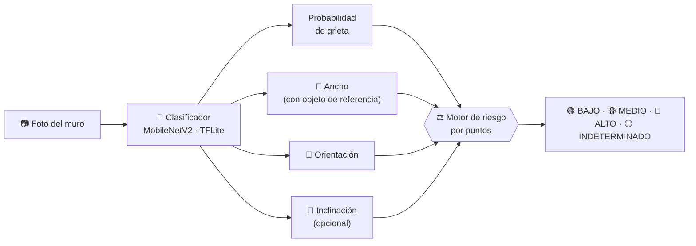
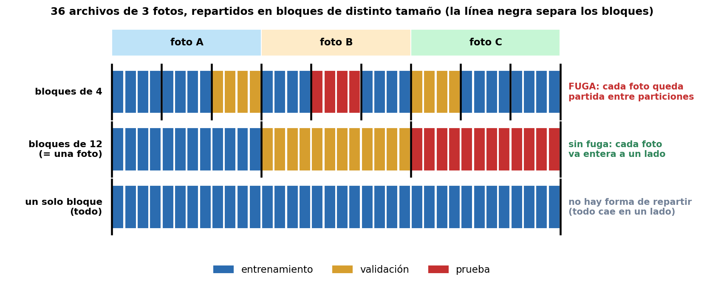
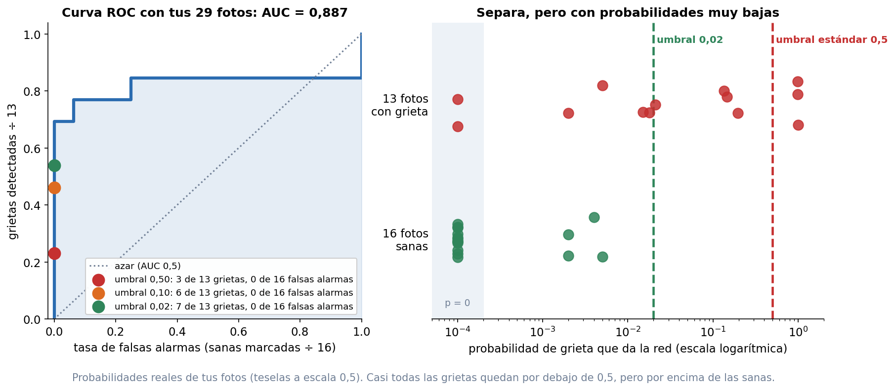
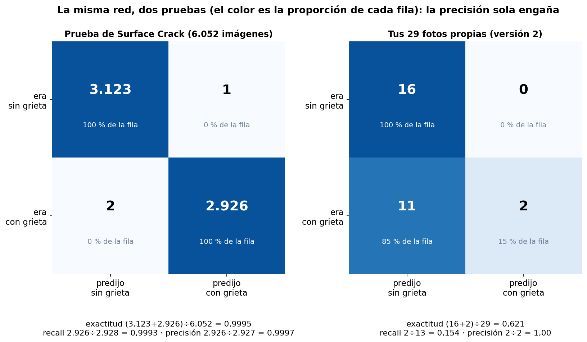
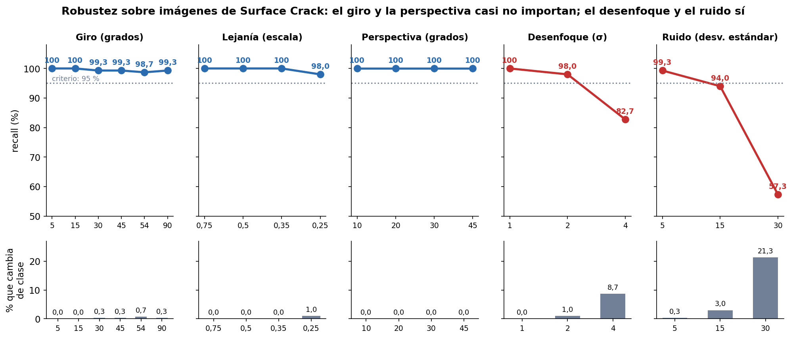
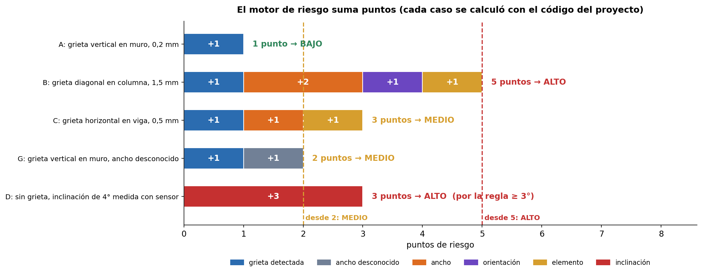
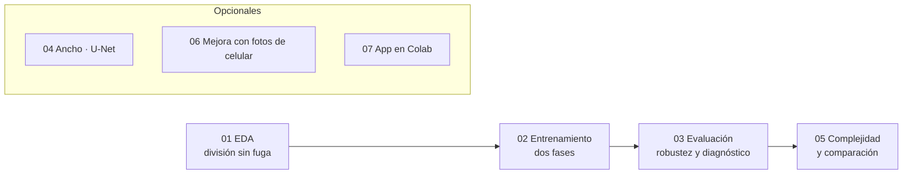

<div align="center">

# 🏗️ Detección de grietas y nivel de riesgo en edificaciones

### De la foto de un muro a una clase, una probabilidad y un nivel de riesgo

<p align="center">
  
  
  
  
  
  
</p>

<sub>Proyecto del reto de **Algoritmos y Programación 2026-2** · Universidad Industrial de Santander (UIS)</sub>

**[🔍 Qué hace](#-qué-hace)** · **[📊 Resultados](#-resultados)** · **[🚀 Reproducir](#-cómo-reproducir-los-resultados)** · **[📱 App](#-cómo-correr-la-aplicación)** · **[🚧 Limitaciones](#-limitaciones)** · **[👥 Autores](#-autores-y-referencias)**

</div>

---

> [!IMPORTANT]
> **Es una herramienta de tamizaje: no sustituye la inspección de un ingeniero.** No detectar una grieta **no significa que no exista**. En fotografías de celular el modelo detecta pocas grietas; los números exactos están en [Resultados](#-resultados) y [Limitaciones](#-limitaciones).

## ✨ En una mirada

| 🎯 **99,95 %** | ⚠️ **2 a 3 de 13** | 🪶 **4,46 MB** | ✅ **137** |
|:---:|:---:|:---:|:---:|
| exactitud en la prueba verificada de Surface Crack | grietas de celular detectadas en fotos propias | modelo TFLite float16 | pruebas automáticas |

## 🔍 Qué hace

El sistema recibe la **foto de un muro** y devuelve la **clase** (con grieta o sin grieta), la **probabilidad** y un **nivel de riesgo** que combina la grieta, su ancho, su orientación, el elemento afectado y la inclinación del muro.



- 🧩 **Fotos grandes** se reducen a 1.280 px de lado largo y se analizan por **teselas** de 224×224 a escala 0,5.
- ⚖️ El **motor de riesgo** suma puntos por grieta, ancho, orientación, elemento e inclinación. Sus reglas están en `src/riesgo.py` y se imprimen con `riesgo.reglas_markdown()`. Son **orientativas, sesgadas a sobreestimar el riesgo, y no están validadas por un ingeniero**.
- 📐 Una inclinación medida **sin saber cuánto giró el celular** puede ser falsa: la aplicación solo la usa si se pide y, cuando es grande (5° o más), marca el nivel ALTO como **«a confirmar»**.

## 📊 Resultados

### ✅ En Surface Crack (el dataset de entrenamiento)

| Conjunto | Imágenes | Exactitud | Recall | Errores |
|---|---:|---:|---:|---|
| Validación | 6.028 | 99,87 % | 99,84 % | 5 grietas no detectadas y 3 falsas alarmas |
| **Prueba verificada** | **6.052** | **99,95 %** | **99,93 %** | 2 grietas no detectadas y 1 falsa alarma |

La prueba **no comparte ninguna imagen ni grupo** con el entrenamiento (se verifica automáticamente). Como referencia, una regresión logística con solo cinco rasgos calculados a mano ya llega a una **exactitud de 98,27 %**: Surface Crack es un conjunto fácil.

### ⚠️ En fotografías propias de celular (29: 13 con grieta, 16 sin grieta)

| Método | Grietas detectadas | Falsas alarmas |
|---|:---:|:---:|
| Foto entera achicada a 224×224 | 2 / 13 | 0 / 16 |
| Teselas a escala 0,5 (el que usa la app) | 3 / 13 | 0 / 16 |

<p align="center">
  
  <br><sub>La misma red en dos pruebas: 99,95 % de exactitud en Surface Crack y 62 % en las fotos propias. La precisión de las fotos propias es 100 % porque casi nunca dice «grieta», pero el recall es de 15 %.</sub>
</p>

> [!WARNING]
> **El modelo no transfiere bien al celular.** Acierta todas las fotos propias con las que entrenó y casi ninguna de las nuevas. La explicación más probable es una **confusión de fuente** (en el entrenamiento, las fotos sanas eran de celular y las agrietadas, de internet). **No está demostrada**: se describe en el informe, con el experimento que la confirmaría o la descartaría.

### 🧪 Lo que encontramos en el análisis

<details>
<summary><b>🔓 Una fuga de información en la versión 1</b></summary>

&nbsp;

Surface Crack tiene 40.000 recortes que salen de **458 fotografías**, pero no dice cuál recorte es de cuál foto. Con una división imagen por imagen (como la de la versión 1), los **913 grupos tenían recortes en entrenamiento y en prueba**: el 99,93 % de la versión 1 **no era una medida confiable**.

**Solución:** bloques de 44 archivos consecutivos por clase (aproximadamente una foto), reparto de bloques enteros y verificación por código. Los archivos consecutivos están a la mitad de distancia de color que dos al azar (razón de adyacencia **0,50**). Los 913 grupos son 455 bloques por clase, 910 en total, más 3 escenas de fotos difíciles.

<p align="center">
  
  <br><sub>Figura ilustrativa con 36 archivos de ejemplo (no son datos reales): con bloques de 4 la foto queda partida; con bloques del tamaño de una foto, no.</sub>
</p>

**Límite:** los grupos aproximan las fotos reales, que el dataset no identifica.

</details>

<details>
<summary><b>🧠 Memorización y atajo de fuente (hipótesis)</b></summary>

&nbsp;

| Grupo de fotos | Fotos | Dice «con grieta» |
|---|---:|---:|
| Vistas, sin grieta | 220 | 0 |
| Vistas, con grieta | 215 | 215 |
| Nuevas, sin grieta | 16 | 0 |
| Nuevas, con grieta | 13 | 2 |

Las filas «vistas» son 44 y 43 fotos únicas repetidas cinco veces. Entre la versión 1 y la 2 las falsas alarmas bajaron de 2 a 0 de 16, pero las grietas detectadas también bajaron de 5 a 2 de 13: **cambió un error por otro**.

**El experimento que lo decidiría:** 20 paredes sanas de internet. Con 8 o más marcadas como grieta, la hipótesis queda apoyada; con 3 o menos, se abandona.

</details>

<details>
<summary><b>🌪️ Robustez: lo que aguanta y lo que no</b></summary>

&nbsp;

Giros de hasta 90° y perspectivas de hasta 45° cambian de clase como máximo el 0,7 % de las imágenes. El **desenfoque y el ruido** sí dañan: con desenfoque fuerte el recall baja a 82,7 % y con ruido de desviación 30, a 57,3 %. El brillo no es un atajo: el 0 % de las imágenes cambia de clase.

<p align="center">
  
</p>

> [!TIP]
> Tomar la foto **enfocada y con buena luz** importa más que sostener el celular derecho.

</details>

<details>
<summary><b>📈 Curva ROC con las 29 fotos propias (exploratorio)</b></summary>

&nbsp;

El AUC es de **0,887**: la red separa las grietas de las sanas, pero con probabilidades muy bajas (casi todas por debajo de 0,5). Es un dato **exploratorio**, calculado con las mismas fotos de prueba.

<p align="center">
  
</p>

</details>

<details>
<summary><b>⚖️ Riesgo, inclinación y despliegue</b></summary>

&nbsp;

El nivel de riesgo es **ALTO** con 5 puntos, con un ancho de 3 mm o más, o con una inclinación de 3° o más; **MEDIO** desde 2 puntos. El medidor de inclinación tuvo un error medio de 0,23° en columnas simuladas realistas (**sin validar con fotos reales**). La puerta de concreto se probó y se **retiró**: calibrada solo con Surface Crack, descartaba las grietas de celular.

<p align="center">
  
</p>

El modelo tiene 2.259.265 parámetros. Exportado a TFLite pesa 8,86 MB en float32, **4,46 MB en float16** y 2,50 MB con cuantización dinámica, sin cambios de clase en 300 imágenes de prueba.

<p align="center">
  
</p>

</details>

## 🗂️ Estructura del repositorio

```
.
├── 📁 src/                  código del sistema
├── 📁 notebooks/            cuadernos de Colab, en orden: 01 a 07
├── 📁 app/                  la aplicación (Streamlit)
├── 📁 tests/                pruebas automáticas con datos sintéticos
├── 📁 taller/               reto de implementación con verificador
├── 📁 docs/                 guías, protocolos y figuras
├── 📁 tools/                utilidades (actualizar el informe)
├── 📄 INFORME_TECNICO.md    informe técnico completo
├── 📄 PLAN_DE_TRABAJO.md    plan de trabajo del equipo
├── 📄 requirements.txt      dependencias de los cuadernos
├── 📄 requirements-app.txt  dependencias solo de la aplicación
└── 🪟 ejecutar_app.bat      lanzador para Windows (ejecutar_app.sh en Mac y Linux)
```

<details>
<summary><b>📦 Qué hace cada módulo de <code>src/</code></b></summary>

&nbsp;

| Módulo | Qué hace |
|---|---|
| `datos.py` | Inventario, grupos, **división sin fuga**, prueba de adyacencia y duplicados |
| `eda.py`, `linea_base.py` | Análisis exploratorio y clasificadores de referencia |
| `modelo.py`, `entrenar.py` | MobileNetV2, aumentación, entrenamiento en dos fases y exportación a TFLite |
| `evaluar.py`, `fotos_propias.py`, `etiquetas.py` | Métricas, pruebas de robustez y evaluación con fotos propias |
| `mosaico.py`, `ancho.py`, `inclinacion.py` | Análisis por teselas, ancho de la grieta e inclinación del muro |
| `riesgo.py`, `predecir.py` | Motor de riesgo y sistema completo |
| `app_core.py`, `app_gradio.py` | Lógica de la aplicación y versión de Colab con Gradio |
| `complejidad.py`, `informe.py`, `verificar.py` | Parámetros, MB y tiempos; informe desde los resultados; verificador de las entregas |

</details>

> [!NOTE]
> Los **modelos, los datos y los resultados** (`models/`, `data/`, `results/`) no se suben a GitHub porque son pesados: se regeneran con los cuadernos.

## 🚀 Cómo reproducir los resultados

Todo se ejecuta en **Google Colab**. La primera celda de cada cuaderno monta tu Drive, encuentra sola la carpeta del proyecto y deja listos los datos.



**Antes de empezar:**

- [ ] Sube la carpeta del proyecto a tu Google Drive.
- [ ] Sube a la raíz de tu Drive el `.zip` del dataset **Surface Crack** (el de Kaggle suele llamarse `archive.zip`).
- [ ] Para los cuadernos 02 y 03 activa la GPU: *Entorno de ejecución → Cambiar tipo de entorno → T4 GPU*.

| Orden | Cuaderno | Qué hace |
|:---:|---|---|
| 1 | `01_EDA.ipynb` | Inventario, análisis exploratorio, línea base y **división por grupos sin fuga** |
| 2 | `02_Entrenamiento.ipynb` | Barrido de tasa de aprendizaje, entrenamiento en dos fases, evaluación y exportación a TFLite |
| 3 | `03_Robustez_y_falso_positivo.ipynb` | Control de integridad de la prueba, resultado en prueba, atajo del brillo, robustez y fotos propias |
| 4 | `05_Complejidad_y_despliegue.ipynb` | Parámetros, MB, tiempos, variantes TFLite y comparación entre versiones |
| opcional | `04_Segmentacion_y_ancho.ipynb` | Segmentación con U-Net para el ancho de la grieta |
| opcional | `06_Mejora_con_fotos_de_celular.ipynb` | Ajuste del modelo con fotos de celular (necesita fotos de muchas paredes distintas) |
| opcional | `07_App_en_Colab.ipynb` | La aplicación con Gradio, sin instalar nada |

**Datos propios.** Las fotografías propias van dentro de `data/` y no se suben al repositorio: `dificiles/<escena>/` (negativos difíciles), `fotos_propias/` (con `etiquetas.csv`, columnas `archivo` y `etiqueta`, 1 con grieta y 0 sin grieta) y `problemas/`. El protocolo para tomarlas está en [`docs/PROTOCOLO_FOTOS_PROPIAS.md`](docs/PROTOCOLO_FOTOS_PROPIAS.md).

**Reproducibilidad.** La semilla es 42. Cada modelo guarda en `models/<nombre>/meta.json` sus hiperparámetros y las versiones de TensorFlow y Keras, y sus particiones en `particion_*.csv`.

## 📱 Cómo correr la aplicación

Hacen falta `models/v2_mobilenet/modelo.keras` y `meta.json` (o `modelo.tflite`), que salen del cuaderno 02.

**En tu computador (Python 3.10, 3.11 o 3.12):**

```bash
pip install -r requirements-app.txt
streamlit run app/streamlit_app.py
```

En Windows también se abre con doble clic en `ejecutar_app.bat`, que crea un entorno e instala todo la primera vez. La app queda en `http://localhost:8501`. Para abrirla desde un celular en la misma red WiFi, usa la dirección **Network URL** que muestra la terminal. La guía completa está en [`docs/GUIA_APP.md`](docs/GUIA_APP.md).

<details>
<summary><b>🛠️ Si algo falla</b></summary>

&nbsp;

- **Windows bloquea TensorFlow** («Una directiva de Control de aplicaciones bloqueó este archivo»): es una protección del sistema, no un error del proyecto. Usa la versión de Colab.
- **Keras no puede leer el modelo:** la app usa `modelo.tflite` automáticamente, o actualiza con `pip install --upgrade tensorflow keras`.
- **No encuentra ningún modelo:** copia `models/v2_mobilenet` a la carpeta `models` del proyecto.

</details>

**☁️ Sin instalar nada:** abre `notebooks/07_App_en_Colab.ipynb` en Colab y ejecuta sus dos celdas. Imprime un enlace público temporal (`gradio.live`) que funciona mientras el cuaderno esté abierto.

> [!TIP]
> **Uso:** sube una foto de un muro **de frente, enfocada y con buena luz**. Para el ancho en milímetros, pega junto a la grieta un objeto de tamaño conocido, como una tarjeta de 85,6 mm. La inclinación del muro es opcional: se mide solo si marcas «Medir la inclinación», para fotos de una columna o un muro sin manos ni objetos delante.

## ✅ Pruebas automáticas

```bash
python tests/run_all.py
```

Ejecutan **137 pruebas** con datos sintéticos, sin TensorFlow ni GPU: división sin fuga, prueba del atajo del brillo, ancho con anchos exactos, rectificación de perspectiva, medidor de inclinación sobre columnas simuladas, motor de riesgo, lectura del `etiquetas.csv` de Excel y lógica de la aplicación. Para ver qué requisitos de las entregas ya tienen evidencia:

```bash
python -m src.verificar
```

## 📚 Material de estudio

La carpeta `taller/` tiene un **reto de implementación**: programar uno mismo la prueba de adyacencia y el reparto por grupos sin fuga. Copia `plantilla_mi_adyacencia.py` como `mi_adyacencia.py`, completa las funciones y comprueba con:

```bash
python taller/verificar_reto.py
```

## 🚧 Limitaciones

> [!CAUTION]
> Estas limitaciones son parte del resultado. Léelas antes de usar el sistema.

1. **Detecta pocas grietas en fotos de celular** (2 a 3 de 13 al umbral estándar), aunque en Surface Crack alcanza 99,95 %.
2. **La validación con fotos propias es muy pequeña** (13 grietas y 16 sanas): un solo error mueve el recall unos 8 puntos.
3. **Posible confusión de fuente** en las fotos de entrenamiento propias (sanas de celular, agrietadas de internet).
4. **Los grupos de la partición son una aproximación** de las 458 fotografías de origen, que el dataset no identifica.
5. **El desenfoque y el ruido** reducen el recall (con ruido de desviación 30, a 57,3 %).
6. **La inclinación** medida sin el giro del celular puede ser falsa, y solo se validó sobre columnas simuladas. Un brazo con manga puede confundirse con una columna.
7. **El ancho de la grieta** nunca se validó contra mediciones reales con un instrumento.
8. **Los umbrales de riesgo** son una heurística del equipo, sin validar con un ingeniero.
9. **La puerta de concreto** (módulo `ood.py`) se retiró del sistema final: calibrada solo con Surface Crack, descartaba las grietas de celular.

## 📄 Documentos

| Documento | Contenido |
|---|---|
| [`INFORME_TECNICO.md`](INFORME_TECNICO.md) | Problema, datos, método, resultados, riesgo, complejidad, ética y conclusiones |
| [`PLAN_DE_TRABAJO.md`](PLAN_DE_TRABAJO.md) | Plan y roles del equipo |
| [`docs/GUIA_APP.md`](docs/GUIA_APP.md) | Cómo instalar y usar la aplicación |
| [`docs/PROTOCOLO_FOTOS_PROPIAS.md`](docs/PROTOCOLO_FOTOS_PROPIAS.md) | Cómo tomar y etiquetar las fotografías propias |
| [`docs/CORRECCION_FALSO_POSITIVO.md`](docs/CORRECCION_FALSO_POSITIVO.md) | El problema de la pared lisa con una mano y cómo se atacó |

## 👥 Autores y referencias

**Autores:** Juan David Sayas Hernandez · Erick Fabian Cardenas Bello · Asignatura Algoritmos y Programación, Universidad Industrial de Santander.

**Referencias principales:**

- Özgenel, Ç. F. y Gönenç Sorguç, A. (2018). *Performance comparison of pretrained convolutional neural networks on crack detection in buildings.* ISARC. Dataset *Concrete Crack Images for Classification* (Surface Crack), Mendeley Data, DOI [10.17632/5y9wdsg2zt.2](https://doi.org/10.17632/5y9wdsg2zt.2), también en Kaggle: consulta su licencia en la página oficial antes de redistribuirlo.
- Sandler, M. et al. (2018). *MobileNetV2: Inverted Residuals and Linear Bottlenecks.* CVPR.
- Howard, A. et al. (2017). *MobileNets: Efficient Convolutional Neural Networks for Mobile Vision Applications.*

Las fotografías tomadas de internet para el entrenamiento se usan con fines académicos y **no se redistribuyen** en este repositorio; el informe indica su origen.

## 🔄 Actualizar el repositorio

```bash
git add .
git commit -m "Describe qué cambiaste"
git push origin main
```

Sin Git, desde el navegador: **Add file → Upload files**, arrastrando todo **menos** `models/`, `data/` y `results/`.

---

<div align="center">

**Hecho con 🧠 y muchas pruebas** · UIS · 2026

<sub>Si algo no coincide con tus resultados, revisa primero [`INFORME_TECNICO.md`](INFORME_TECNICO.md): ahí está el detalle de cada número.</sub>

</div>
